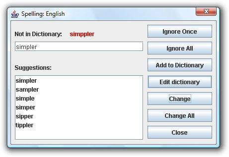
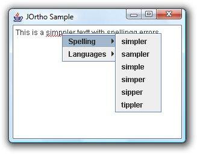
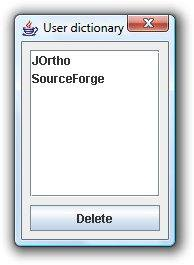

Copied from: 

http://jortho.sourceforge.net/

#Changes
- Mavenized
- Jortho spelling dictionaries are in the classpath (ar,de,en,es,fr,it,nl,pl,ru)

# Usage

        <dependency>
            <groupId>io.github.geniot</groupId>
            <artifactId>jortho</artifactId>
            <version>1.1</version>
        </dependency>

https://github.com/geniot/jortho/blob/main/src/test/java/io/github/geniot/jortho/SampleApplication.java

<h1>JOrtho - a Java spell-checking library</h1>

JOrtho (Java Orthography) is a Open Source spell-checker entirely written in Java. Its 
dictionaries are based on the free
<a href="http://wiktionary.org/">Wiktionary</a> project and 
can therefore be updated for virtually any language. The library
works with any JTextComponent from the Swing framework. This
includes JTextPane, JEditorPane and JTextArea.

<h2>Table of Contents</h2>
<ul class="TOC">
<li><a href="#features">Features</a></li>
<li><a href="#require">System Requirements</a></li>
<li><a href="#look">What it looks like</a></li>
<li><a href="#download">Download</a></li>
<li><a href="#license">Licensing</a></li>
<li><a href="#faq">FAQ</a></li>
<li><a href="#dictionaries">Creating Dictionaries</a></li>
<li><a href="#changes">Changes</a></li>
</ul>

<h2><a name="features">Features</a></h2>

What does the library do when it is bound to a JTextComponent?

<ul class="level2">
<li>highlight the potentially wrongly spelled word</li>
<li>offer a context menu with suggestions for a correct form
of the word</li>
<li>context menu with options to change the checking language</li>
<li>dialog (when pressing F7 key) to continuously spell check
the text</li>
<li>user-defined dictionary for words that are not in the
global one (this is an option that appears inside the
continuous checking dialog)</li>
<li>translated spell checker GUI so users will see buttons
and labels in the language of the current locale</li>
<li>standalone
<a href="http://www.inetsoftware.de/products/tools/JOrtho/API/">API</a>, no server is required but applets are possible,
<a href="http://www.inetsoftware.de/products/tools/JOrtho/sample.htm">see the sample</a>.</li>
<li>detects capitalization errors</li>
<li>enable or disable each feature separately</li>
</ul>
<h2><a name="require">System Requirements</a></h2>

JOrtho has the following requirements to run smoothly:

<ul class="level2">
<li>Java 5 or higher</li>
<li>2 - 5 MB free memory in the JavaVM (depending on the 
dictionary)</li>
</ul>
<h2><a name="look">What it looks like</a></h2>

<a href="http://www.inetsoftware.de/products/tools/JOrtho/sample.htm">There is a small live sample applet of 
JOrtho </a>where you can test the spelling of a text. You can 
freely modify this text to get an impression of JOrtho in 
action.

<h2><a name="download">Download</a></h2>

The free tool and the dictionaries can be downloaded at
.

The API is available 
<a href="http://www.inetsoftware.de/products/tools/JOrtho/API/">here</a>. You may also
<a href="http://www.inetsoftware.de/products/tools/JOrtho/sample.htm">view a live sample</a>.

                <h2><a name="license">Licensing</a></h2>

JOrtho is published under the <!-- google_ad_section_start -->
GNU General Public License (GPL) for inclusion in programs published under a compatible open-source license. 
If you want to use JOrtho in a commercial product then you can <a href="https://www.inetsoftware.de/store?inetShopProductSelect=28" title="i-net software Online Store">order it in our shop</a>.

If you have further questions on licensing, please contact:
<a href="mailto:&#x53;&#x61;&#x6c;&#x65;&#x73;&#x40;&#x69;&#x6e;&#x65;&#x74;&#x73;&#x6f;&#x66;&#x74;&#x77;&#x61;&#x72;&#x65;&#x2e;&#x64;&#x65;">&#x53;&#x61;&#x6c;&#x65;&#x73;&#x40;&#x69;&#x6e;&#x65;&#x74;&#x73;&#x6f;&#x66;&#x74;&#x77;&#x61;&#x72;&#x65;&#x2e;&#x64;&#x65;</a>

<h2><a name="faq">FAQ</a></h2>
                <blockquote>
                  
<strong>Which languages are supported by JOrtho?</strong>

Please have look at the download area at
<a title="Download JOrtho" href="http://sourceforge.net/project/showfiles.php?group_id=210885">
SourceForge</a>.

<strong>JOrtho does not support my language. How can I add
a language?</strong>

<ul>
<li>Have a look at the <a href="http://wiktionary.org/">
Wiktionary</a> project for
your language. There should be at minimum 50.000 entries.</li>
<li>Translate the resource file of JOrtho into your
language and <a href="mailto:tools&#64;inetsoftware.de">send
it to us</a>.</li>
<li>Help us on parsing the Wiktionary for your language.
We will have some questions to the language dependent
format of the flexion (i.e. the various grammatical
forms of words).</li>
</ul>

<b>Where can I get support for this tool?</b>

                  <ul>
<li>For the GPL license, support is available on
.</li>
<li>For the commercial license, support is available via
                  <a href="mailto:tools&#64;inetsoftware.de">e-mail</a>.</li>
<li>For any other questions, please
<a href="mailto:tools@inetsoftware.de">contact us</a>.</li>
</ul>

<b>Some important words are missing in the dictionary. How can I add
them?</b>

Look in the
<a href="http://wiktionary.org/">Wiktionary</a>
for your
language. If the word is missing, then add it. If the word
exists, then look at how recent the entry was added/created. We will
be creating new dictionaries
periodically. It could also be that JOrtho is incorrectly
parsing the entry. In this case, please let us know.

<b>Who is responsible for JOrtho?</b>

JOrtho is an Open Source project of <em>
<a href="http://www.inetsoftware.de">i-net software</a></em>

                </blockquote>
<h2><a name="dictionaries">Creating Dictionaries</a></h2>

<strong>File Format</strong>

The dictionaries files are a list of words. Every word is saved in a separate line. The word list is saved in UTF8 encoding. The resulting file is compressed with gzip.

<strong>Generate dictionaries from Wiktionary</strong>

The dictionaries are based on the Wiktionary dictionaries. This is a step by step description how you can generate a new dictionary version.

<ol>
<li>Download the data from Wiktionary. The file for the English language is http://download.wikimedia.org/<strong>en</strong>wiktionary/latest/<strong>en</strong>wiktionary-latest-pages-articles.xml.bz2  
Replace the red part with your language. Some languages also require the data of the English Wiktionary (currently Polish and Arabic)</li>
<li>Extract the XML file from the archive</li>
<li>Download or check out the sources of JOrtho and compile it.</li>
<li>Execute the command 
<code>java -Xmx256M io.github.geniot.jortho.jorthodictionaries.BookGenerator </code> 
<strong class="style1"><code>en</code></strong><code> 
&lt;wiktionary folder&gt;</code> 
Replace the red part with your language. </li>
</ol>

<h2><a name="changes">Changes</a></h2>
<h3>Changes in Version 0.1 (2007-12-13)</h3>
<ul class="level3">
<li>This was the initial public version.</li>
</ul>
<h3>Changes in Version 0.2 (2008-01-02)</h3>
<ul class="level3">
<li>Threading problems fixed.</li>
<li>Single characters are ignored.</li>
<li>The extension for the dictionaries can be set now. This 
fixes a problem with unknown extensions and IIS.</li>
<li>Added support for a configuration file.</li>
<li>Added support for formatted text.</li>
<li>Improved suggestion list.</li>
<li>Added a reference implementation for
UserDictionaryProvider.</li>
<li>Added an editor for the user dictionary.</li>
</ul>
<h3>Changes in Version 0.3 (2008-03-11)</h3>
<ul class="level3">
<li>Use mouse position and not cursor position in text for
suggestions.</li>
<li>Added support for Escape key.</li>
<li>Added alphabetical sort order in the user dictionary editor.</li>
<li>Added support for setting an application name.</li>
<li>Added some improvements to the user dictionary editor.</li>
<li>Application sample added.</li>
<li>The method SpellChecker.showSpellCheckerDialog( 
JTextComponent ) was added.</li>
<li>Italian, Spanish, French and Russian translation added.</li>
<li>Dictionaries for Italian, Spanish and French added.</li>
<li>Support of capitalization improved.</li>
<li>The class SpellCheckerOption added and add as optional 
parameter to many methods.</li>
<li>A JPopupMenu with suggestion was added.</li>
</ul>
<h3>Changes in Version 0.4 (2008-12-05)</h3>
<ul class="level3">
<li>Added an Icon for the dialogs. This only works with Java 6.</li>
<li>Add the polish translation.</li>
<li>The pressing of the ENTER key in text and creating a new
paragraph has not handle correctly the highlight. The effect
can be doubled underling.</li>
<li>Email addresses and web addresses will be ignored.</li>
<li>Added the options IgnoreCapitalization, IgnoreAllCapsWords and IgnoreWordsWithNumbers.</li>
<li>Translations for Czech und Slovak are added.</li>
<li>A memory leak in SpellChecker.createLanguagesMenu() was fixed.</li>
<li>The spell checker dialog position is set relative to the
visible rectangle and not the bounds rectangle.</li>
<li>A possible IllegalArgumentException which could occur with the context
menu if the mouse pointer was not on a valid position was
fixed.</li>
</ul>
<h3>Changes in Version 0.5 (2010-06-10)</h3>
<ul class="level3">
<li>Add the Croatian translation.</li>
<li>Add the interface CustomDictionaryProvider.</li>
<li>Translation for Dutch added.</li>
<li>After a change in the spell checker dialog the search has continue from the wrong position if it was not the first sentence in the current paragraph.</li>
</ul>
<h3>Changes in Version 1.0 (2013-03-11)</h3>
<ul class="level3">
<li>The method SpellChecker.isDictionaryLoaded() was added.</li>
<li>The dictionary is now reloaded after deleting a word from the custom dictionary.</li>
<li>Reduced the temporary memory usage on loading a dictionary. For example for the current English dictionary memory usage reduced from 47 MB to 30 MB.</li>
<li>Fix a bug in the suggestion list where there are shorter words that start with the same characters.</li>
<li>Translation for Danish added.</li>
<li>Words ending with a period such as "etc." are checked now.</li>
<li>Handle a colon like a period: the next word can start in upper case.</li>
<li>Add a tool for converting a plain txt file with words to a dictionary.</li>
<li>Dictionaries are searched in the classpath if there is no base URL.</li>
<li>Translations for Portuguese added.</li>
<li>Handle words with curly apostrophe (’) for the French wiktionary.</li>
<li>Added an "about" dialog.</li>
<li>Improved the parser for the Spanish dictionary.</li>
</ul>